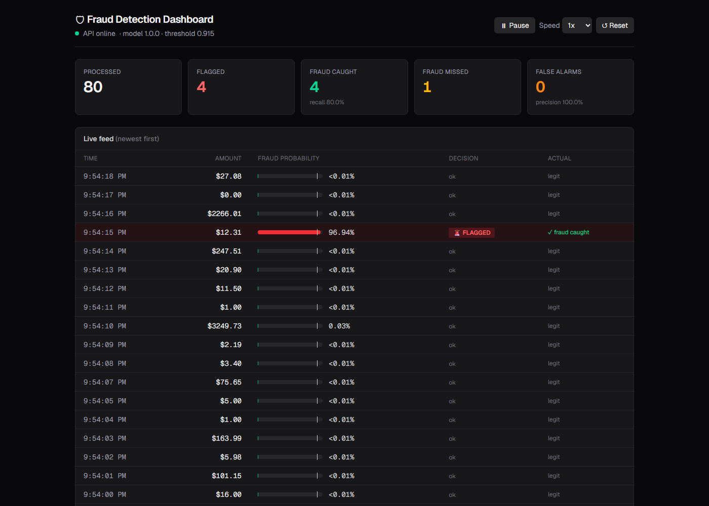

# Fraud Detection Engine

A credit card fraud detector built end to end: a model trained in Python, served by a C# API, and watched live on a Next.js dashboard.

You give it a transaction, and it tells you how likely it is to be fraud and whether it should be flagged. That takes about a millisecond.



## Results

Scored once on a held-out test set of 56,746 transactions the model never saw:

| Metric | Value |
|---|---|
| PR-AUC | 0.822 |
| Recall | 74.7% (caught 71 of 95 frauds) |
| Precision | 95.9% (71 of 74 alerts were real fraud) |
| False alarms | 3 out of 56,651 legit transactions |

So when it flags something, it's almost always right. It misses about a quarter of fraud, and I explain why further down.

## How it works

The project is three separate pieces that hand off to each other:

```
 Python (ML engine)            C# (API)                     Next.js (dashboard)
 ──────────────────            ────────                     ───────────────────
 Learns what fraud      ──▶    Loads the trained      ◀──   Sends transactions one
 looks like from               model and answers            at a time and shows the
 284,807 transactions          "is this fraud?"             answers live
        │                             ▲
        └──── fraud_model.onnx ───────┘
              model_schema.json
```

The Python code never runs inside the API. Only two files cross over: the model itself (`fraud_model.onnx`) and a contract (`model_schema.json`) that says which 30 inputs the model expects, in what order, and what threshold to use. That way the API doesn't need Python installed, and the model can be swapped by dropping in two new files.

### 1. ML engine (`src/`, `notebooks/`)

Built on the [Kaggle Credit Card Fraud dataset](https://www.kaggle.com/datasets/mlg-ulb/creditcardfraud): 284,807 real transactions from 2 days, with features `V1`–`V28` already anonymized by the bank using PCA.

The main problem is that fraud is only 0.17% of the data. A model that says "not fraud" every single time gets 99.83% accuracy and catches a crisp zero frauds. So accuracy is useless here, and everything is measured with **PR-AUC**, **recall** and **precision** instead.

What I found in the EDA and what I did about it:

- **Imbalance:** 1 fraud per 578 legit transactions. Handled with XGBoost's `scale_pos_weight` and a stratified split so the test set keeps the same fraud rate.
- **Duplicates:** 1,081 exact duplicate rows (19 of them fraud). Dropped before splitting, otherwise copies leak into the test set and inflate the score.
- **Time:** the raw `Time` column is "seconds since the first transaction," which means nothing for a live transaction. The transaction volume dips around 4 AM, which puts the start at about midnight, so I turned it into an **hour of day** feature. Legit volume drops at night but fraud doesn't, which is why the feature is worth keeping.
- **Scaling:** the V-features are already on a small scale from PCA, but `Amount` goes up to about 25,000, so `Amount` and `hour` needed scaling for logistic regression. XGBoost doesn't care.

I compared models the way you'd climb a ladder, where each step has to beat the last one:

| Model | PR-AUC (test) |
|---|---|
| Always say "not fraud" | 0.0017 |
| Logistic regression (unscaled) | 0.655 |
| Logistic regression (scaled) | 0.671 |
| **XGBoost (class weights)** | **0.822** |

I also tried SMOTE against class weights. On a single validation set SMOTE looked better, but 5-fold cross-validation showed it was just noise (0.849 ± 0.027 vs 0.846 ± 0.031). I went with class weights because it gave a lot fewer false alarms and a simpler export.

The decision threshold (0.915) was picked from out-of-fold predictions across all 378 training frauds, targeting 80% recall. On the test set it gave 74.7%. That gap is within the noise cross-validation showed, and the test set just happens to have slightly harder frauds. The bigger reason recall tops out around 75% is that the frauds it misses get probabilities near zero. They look completely normal to the model, so lowering the threshold doesn't really help.

The final model is exported to ONNX and checked against Python's predictions (max difference 9.3e-08).

### 2. API (`api/`)

An ASP.NET Core (.NET 10) minimal API that loads the ONNX model once at startup with ONNX Runtime.

| Endpoint | What it does |
|---|---|
| `GET /health` | Returns `{"status":"ok"}` |
| `GET /model-info` | Shows the loaded contract: features, threshold, version |
| `POST /predict` | Scores a transaction |

Example request:

```json
{
  "timestamp": "2026-10-10T15:47:00+03:00",
  "features": { "V1": -1.3598, "V2": -0.0728, "...": 0, "V28": -0.0211, "Amount": 149.62 }
}
```

Response:

```json
{ "fraudProbability": 0.0000173, "isFraud": false, "threshold": 0.9152014, "modelVersion": "1.0.0" }
```

The caller sends features by name, and the API puts them in the order the schema says, so nobody can mix up the order by accident. `hour` is computed from the timestamp using the transaction's own local time. If a feature is missing, it returns a 400 with the list of what's missing. If the schema or model file is broken, the API refuses to start instead of serving bad predictions.

I checked the API against Python on 495 real test transactions. The probabilities matched within 3e-08, and every fraud decision was identical.

### 3. Dashboard (`dashboard/`)

A Next.js app that replays transactions through the API and shows the results as they come in.

The transactions are real. They're rows from the test set, so the model never trained on any of them. Three things are simulated:

- **Timing:** one transaction per second (adjustable up to 10x)
- **Fraud mix:** about 5% fraud (all 95 test frauds plus 1,900 legit). The real rate is 0.17%, which means you'd wait around 10 minutes between frauds.
- **Timestamp:** each one gets the current time. I checked how much this matters: across the whole test set it changes at most 1 decision out of 56,746.

Every probability on the screen is computed live by the model through the API. Since the dashboard knows the true answer for each transaction, it also shows whether the model got it right (fraud caught, fraud missed, or false alarm) and keeps a running recall and precision.

## Try it

You need the [.NET 10 SDK](https://dotnet.microsoft.com/download) and [Node.js](https://nodejs.org) 20 or newer. You don't need Python or the dataset just to run it, since the trained model and the demo transactions are already in the repo.

```
git clone https://github.com/tseliasas/fraud-detection-engine.git
cd fraud-detection-engine
```

Start the API in one terminal:

```
cd api
dotnet run
```

Wait for `Now listening on: http://localhost:5259`, then start the dashboard in a second terminal:

```
cd dashboard
npm install
npm run dev
```

Open http://localhost:3000. You should see a green "API online" dot and a new transaction every second. The first flagged fraud shows up within about a minute. Set the speed to 10x to get through a few hundred and watch recall and precision settle.

Other things to try:

- Open http://localhost:5259/model-info to see what the API loaded.
- Open `api/FraudApi.http` in VS Code with the REST Client extension. It has ready-made legit, fraud and missing-feature requests.
- Stop the API while the dashboard is running. You get a red banner, and the feed picks back up by itself when the API comes back.

## Rebuild the model yourself

This part needs Python 3.12 and the dataset.

1. Download `creditcard.csv` from [Kaggle](https://www.kaggle.com/datasets/mlg-ulb/creditcardfraud) and put it in `data/raw/`. It's about 150 MB, which is over GitHub's file limit, so it's not in the repo.
2. Set up the environment:

```
python -m venv venv
venv\Scripts\activate            # Windows
source venv/bin/activate         # Mac / Linux
pip install -r requirements.txt
```

3. Retrain and re-export:

```
cd src
python final_model.py                # trains, tunes the threshold, exports the model + schema
python export_demo_transactions.py   # rebuilds the dashboard's demo data
```

`python train.py` runs all the model comparisons (baselines, logistic regression, XGBoost, SMOTE, cross-validation), and `notebooks/01_eda.ipynb` has the exploration.

## Project structure

```
fraud-detection-engine/
├── notebooks/01_eda.ipynb        exploration and the decisions it led to
├── src/
│   ├── data_prep.py              load, clean (dedupe + hour feature), stratified split
│   ├── train.py                  model comparisons and cross-validation
│   ├── final_model.py            final training, threshold tuning, ONNX export
│   └── export_demo_transactions.py
├── models/
│   ├── fraud_model.onnx          the trained model
│   └── model_schema.json         the contract between Python and C#
├── api/                          C# inference API
└── dashboard/                    Next.js live dashboard
```

## Limitations

- **Only 2 days of data.** The hour-of-day pattern comes from two nights, so some of the fraud spikes might just be a single attacker.
- **Small test set.** 95 test frauds means recall moves about 1% per fraud. Cross-validation puts PR-AUC at about 0.85 ± 0.03, so treat any single number with that in mind.
- **Anonymized features.** `V1`–`V28` can't be interpreted, so I can't say *why* a transaction looks like fraud. I can only say that it does.
- **Missed frauds are confident misses.** About a quarter of fraud looks normal to the model, and no threshold fixes that. Doing better would need different features, not more tuning.

## Tech stack

Python, pandas, scikit-learn, imbalanced-learn, XGBoost, ONNX, C# / ASP.NET Core (.NET 10), ONNX Runtime, Next.js, React, TypeScript, Tailwind CSS
